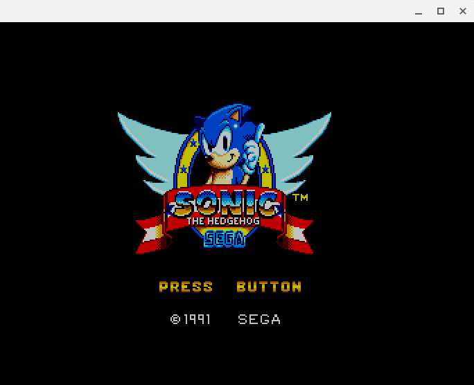
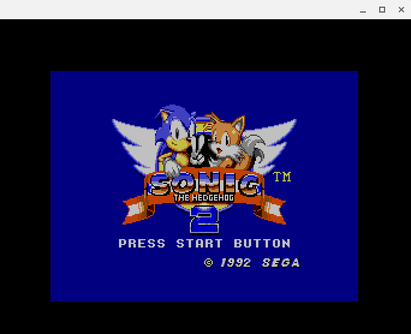
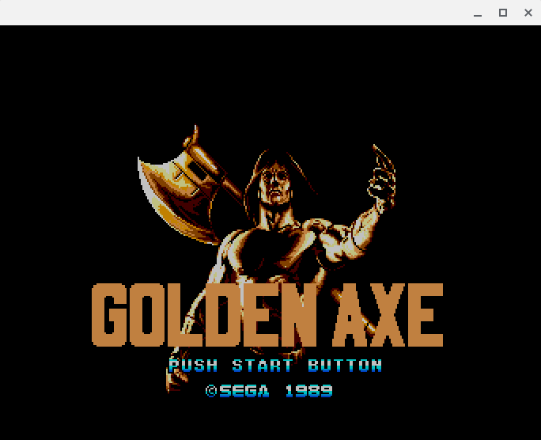
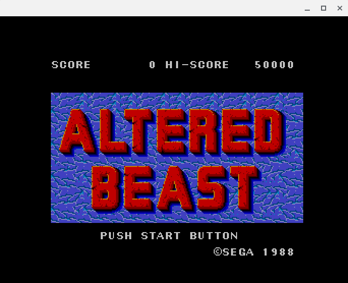
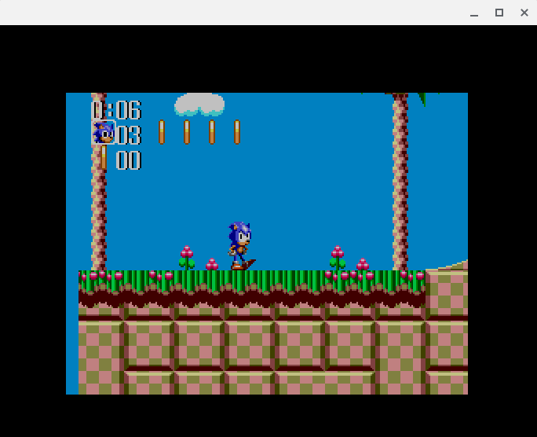
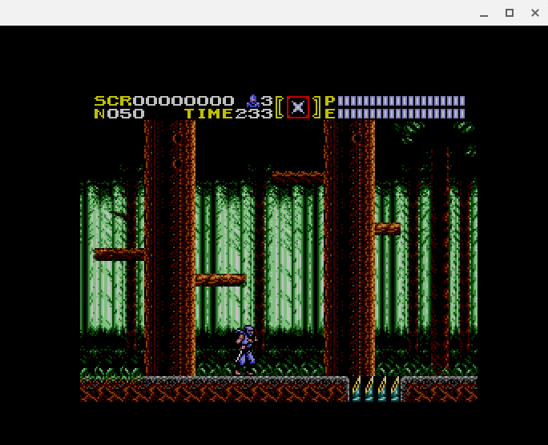

# TotalSMS

Simple Sega Master System / Game Gear / Sg1000 emulator!

## Showcase

|                          |                          |
:-------------------------:|:-------------------------:
 | 
 | 
 | 

## Building

to build a simple SDL2 based example, you will need

- SDL2 (any version)

- cmake (3.18 or higher)

```sh
git clone https://github.com/ITotalJustice/TotalSMS.git
cd TotalSMS
cmake -B build -DSDL2=ON -DCMAKE_BUILD_TYPE=Release
cmake --build build -j4
```
this will build the binary in `build/bin/TotalSMS_SDL2`

so to load a rom, you can do `./build/bin/TotalSMS_SDL2 path/to/rom.zip`

## Controls

- KEY_X     : A
- KEY_Z     : B
- KEY_UP    : UP
- KEY_DOWN  : DOWN
- KEY_LEFT  : LEFT
- KEY_RIGHT : RIGHT

- CTRL + KEY_S    : savestate
- CTRL + KEY_L  : loadstate

## Reporting bugs

if you find any issues, please open an issue.

if it is a graphical bug, if possible, include a screenshot or video.

## Credits

smspower for having all sms info in one place! <https://www.smspower.org/>
<http://www.z80.info/zip/z80.pdf>
